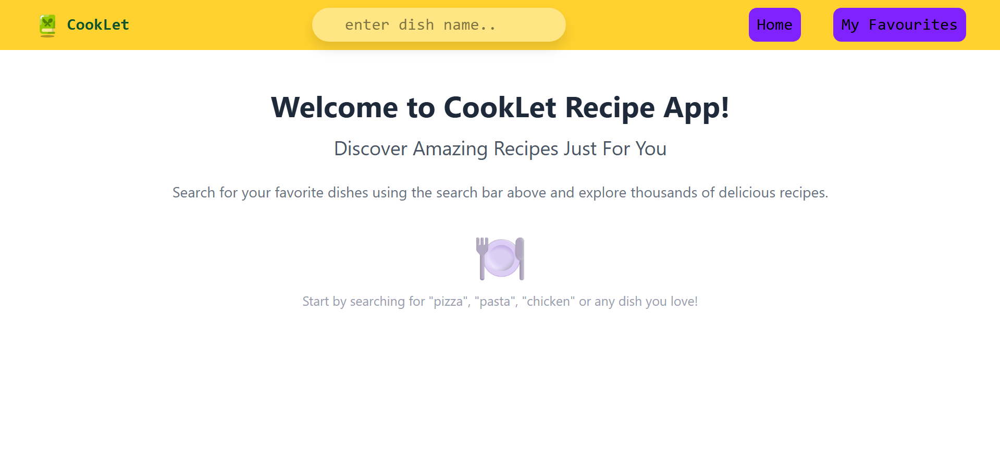
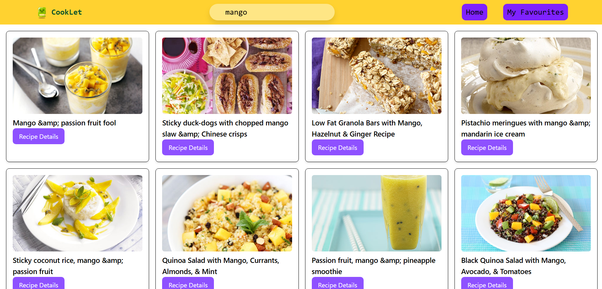
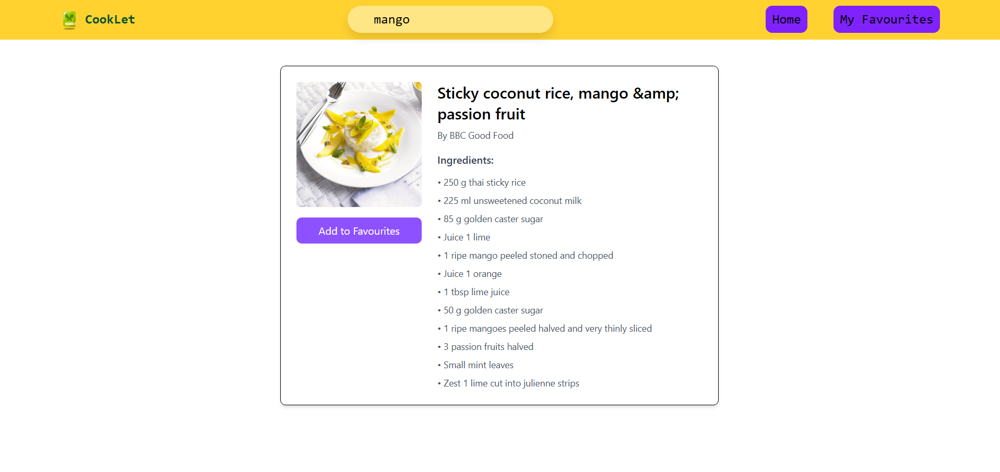
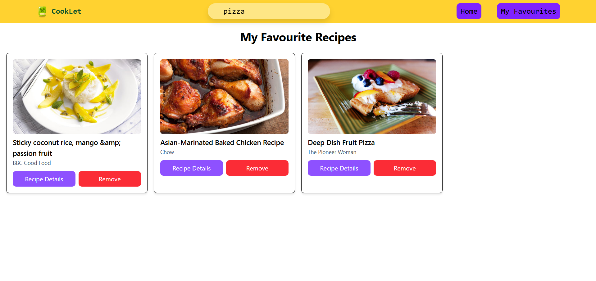

# CookLet - Food Recipe App

A modern recipe discovery application built with React.

## Features

- Search thousands of recipes with Restful API
- View detailed recipe information with ingredients
- Save favorite recipes
- Responsive design for all devices

## Screenshots

##### Home 

##### Recipe Search Results

##### Recipe Details

##### Favourites Page

## Tech Stack

- React.js + React Router
- Tailwind CSS
- Vite

## React Concepts Used

- **React Hooks**: useState, useEffect, useContext, useParams
- **Context API**: Global state management for recipes and favorites
- **React Router**: Navigation between pages with dynamic routing
- **RESTful API Integration**: Fetch API for HTTP requests and data handling
- **Component Composition**: Reusable components (NavBar, RecipeCards, etc.)
- **Conditional Rendering**: Dynamic UI based on loading/error states
- **Event Handling**: Form submissions and user interactions
- **Array Methods**: map, filter, find for data manipulation

## API

Powered by **Forkify API v2** - https://forkify-api.jonas.io/v2
